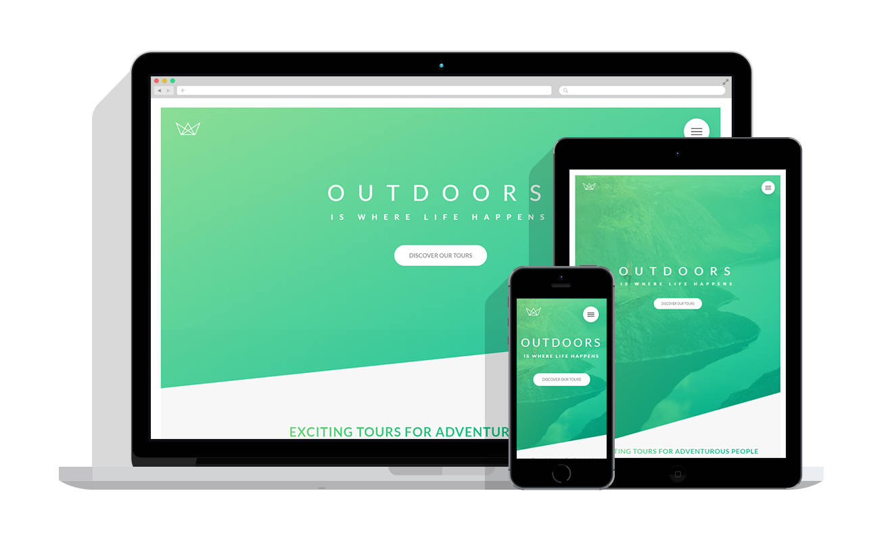

## Nature Landing Page

A website I made using floats, the first project from [Advanced CSS and SASS](https://www.udemy.com/course/advanced-css-and-sass/) course

  <a href="https://kien-nature-site.netlify.com/">Live Demo</a>

  

## 👨‍🎓What I learned:

- How to use media queries and properly create a SASS starter file

## Personal Application:

- Learned how to use pseudo-classes and adding nice hover effects with forms and buttons
